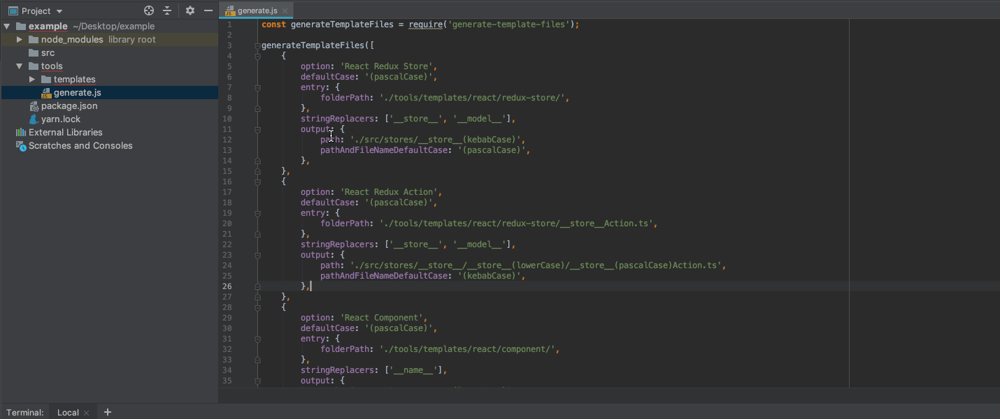

# `generate-template-files`

[![NPM version][npm-img]][npm-url] [![Downloads][downloads-img]][npm-url]

A simple generator that is independent of any language. Create custom boilerplate, scaffolding, skeleton, and templating code files that you need to create over and over again. All you need is [NodeJS](https://nodejs.org) installed to get started.

> Find this useful? Give it a :star:



Medium Article - [Generate Template Files with Ease](https://medium.com/@robertsavian/generate-template-files-with-ease-19b320615359)

## Install

With [NPM](http://npmjs.com):

```command
$ npm install generate-template-files
```

With [Yarn](https://yarnpkg.com):

```command
$ yarn add generate-template-files
```

## Usage

1. Check out the `examples` folder or create a file called `generate.js`. Note that this file name is flexible.
2. In that file, add in the example code below.
3. Run `node generate.js` within Terminal (Mac) or Powershell (Win) once you've added your template files.

```js
const { generateTemplateFiles } = require('generate-template-files');

const config = require('../package.json');

generateTemplateFiles([
  {
    option: 'Create Redux Store',
    defaultCase: '(pascalCase)',
    entry: {
      folderPath: './tools/templates/react/redux-store/',
    },
    stringReplacers: ['__store__', { question: 'Insert model name', slot: '__model__' }],
    output: {
      path: './src/stores/__store__(lowerCase)',
      pathAndFileNameDefaultCase: '(kebabCase)',
      overwrite: true,
    },
  },
  {
    option: 'Create Reduce Action',
    defaultCase: '(pascalCase)',
    entry: {
      folderPath: './tools/templates/react/redux-store/__store__Action.ts',
    },
    stringReplacers: ['__store__', '__model__'],
    dynamicReplacers: [
      { slot: '__version__', slotValue: config.version },
      { slot: '__description__', slotValue: config.description },
    ],
    output: {
      path: './src/stores/__store__/__store__(lowerCase)/__store__(pascalCase)Action.ts',
      pathAndFileNameDefaultCase: '(kebabCase)',
    },
    onComplete: (results) => {
      console.log(`results`, results);
    },
  },
]);
```

As outlined in the `examples` folder, I prefer to create a `tools` folder and place `generate.js` w/ `templates` files in there. Additionally, I'll add a script task (`"generate": "node ./tools/generate.js"`) to my `package.json` file for convienent running of the generator using `npm run generate` or `yarn generate`.

```
┣━ package.json
┣━ src
┗━ tools/
   ┣━ generate.js
   ┗━ templates/
      ┣━ SomeFile.js
      ┗━ __name__(pascalCase)Action.ts
```

## API

The `generateTemplateFiles` function takes an array of `IConfigItem` items.

#### `IConfigItem`

- `option` - The name of the option to choose when asked.
- `defaultCase` - The default [Case Converters](#case-converters) to use with the [Replacer Slots](#replacer-slots-or-ireplacerslotquestion) in the template files. Default is `(noCase)`.
- `entry.folderPath` - Path to a folder of files or a single template file.

- `stringReplacers` - An array of [Replacer Slots](#replacer-slots-or-ireplacerslotquestion) used to replace content in the designated `entry.folderPath`.
- `dynamicReplacers` - (Optional) An array of IReplacer used to replace content in the designated `entry.folderPath`.
- `output.path` - The desired output path for generated files. [Case Converters](#case-converters) and [Replacer Slots](#replacer-slots-or-ireplacerslotquestion) can be used to make the path somewhat dynamic.
- `output.pathAndFileNameDefaultCase` - The [Case Converters](#case-converters) to use for the file path and file name(s).
- `output.overwrite` - (Optional) When `true` it will overwrite any files that are named the same.
- `onComplete` - (Optional) Takes a callback function that is called once the file(s) have been outputted. A [IResults](#iresults) object will be passed to the callback.

###### Example

```javascript
{
    option: 'Create Redux Store',
    defaultCase: '(pascalCase)',
    entry: {
        folderPath: './tools/templates/react/redux-store/',
    },
    stringReplacers: ['__store__', { question: 'Insert model name', slot: '__model__' }],
    dynamicReplacers: [
        {slot:'__version__', slotValue: config.version},
        {slot:'__description__', slotValue: config.description}
    ],
    output: {
        path: './src/stores/__store__(lowerCase)',
        pathAndFileNameDefaultCase: '(kebabCase)',
    },
    onComplete: (results) => {
        console.log(results);
    },
},
```

#### `IResults`

Below is an example of what you receive from the `onComplete` callback. It has the output path, list of files created and the [Replacer Slots](#replacer-slots-or-ireplacerslotquestion) with the value entered.

- `output.path` - The file(s) output path
- `output.files` - List of files created
- `stringReplacers` - List of [Replacer Slots](#replacer-slots-or-ireplacerslotquestion); name and values entered during the setup process

###### Example data you would get from the onComplete callback

```javascript
{
    output: {
        path: './src/stores/some-thing',
        files: [
            './src/stores/some-thing/SomeThingModule.ts',
            './src/stores/some-thing/SomeThingModuleAction.ts',
            './src/stores/some-thing/SomeThingModuleGetter.ts',
            './src/stores/some-thing/SomeThingModuleMutation.ts',
            './src/stores/some-thing/SomeThingService.ts',
            './src/stores/some-thing/models/actions/ISomeThingState.ts',
            './src/stores/some-thing/models/actions/OtherThingResponseModel.ts'
        ]
    },
    stringReplacers: [
        {
            slot: '__store__',
            slotValue: 'some thing'
        },
        {
            slot: '__model__',
            slotValue: 'other thing'
        }
    ]
}
```

### Replacer Slots or IReplacerSlotQuestion

[Replacer Slots](#replacer-slots-or-ireplacerslotquestion) are unique string value(s) to be replaced by the generator. An array of string values and/or `IReplacerSlotQuestion` objects can be used.

```javascript
stringReplacers: ['__store__', { question: 'Insert model name', slot: '__model__' }];
```

Replacer slot can be any string value you want to use. You can use something like this in your template files and/or in the file path names.

- `~replacerSlot~`
- `{{something else}}`
- `__AnythingYouWant__`

#### `IReplacerSlotQuestion`

Below is an example of a `IReplacerSlotQuestion`

```javascript
{question: 'Insert model name', slot: '__model__'}
```

- `question` - The question to ask the use what value should be used for the replacer `slot`
- `slot` - The string value for the [Replacer Slots](#replacer-slots-or-ireplacerslotquestion)

#### Dynamic Replacer Slots

If you have data that is dynamically generated, or you have hard coded values you can use the `dynamicReplacers`:

```javascript
dynamicReplacers: [
  {slot:'__description__', slotValue: config.description}
],
```

### Case Converters

[Case Converters](#case-converters) transform the string value entered upon use of the generator.

Example

- In the generator template `__replacerSlot__` is appended by the `(pascalCase)` converter such as `__replacerSlot__(pascalCase)`.
- When the generator is ran, the string `"product reducer"` is provided for `__replacerSlot__`.
- As a result, the converter will produce `ProductReducer`.

Here is the string `Lives down BY the River` with each of the converters:

```js
// If you typed in 'Lives down BY the River' for the a Replacer Slot named '__replacerSlot__' and
// used one of the optional Case Converters you would get the following:

__replacerSlot__(noCase)       // Lives down BY the River
__replacerSlot__(camelCase)    // livesDownByTheRiver
__replacerSlot__(constantCase) // LIVES_DOWN_BY_THE_RIVER
__replacerSlot__(dotCase)      // lives.down.by.the.river
__replacerSlot__(kebabCase)    // lives-down-by-the-river
__replacerSlot__(lowerCase)    // livesdownbytheriver
__replacerSlot__(pascalCase)   // LivesDownByTheRiver
__replacerSlot__(pathCase)     // lives/down/by/the/river
__replacerSlot__(sentenceCase) // Lives down by the river
__replacerSlot__(snakeCase)    // lives_down_by_the_river
__replacerSlot__(titleCase)    // Lives Down By The River

// Note: you can set a 'defaultCase' converter in IConfigItem so all
// Replacer Slots without a Case Converter will be transformed the same way.
__replacerSlot__; //                LivesDownByTheRiver
```

You may also specify the case using an underscores-only syntax e.g. `PascalCase__`:

```js
__replacerSlot__NoCase__       // Lives down BY the River
__replacerSlot__CamelCase__    // livesDownByTheRiver
__replacerSlot__ConstantCase__ // LIVES_DOWN_BY_THE_RIVER
__replacerSlot__DotCase__      // lives.down.by.the.river
__replacerSlot__KebabCase__    // lives-down-by-the-river
__replacerSlot__LowerCase__    // livesdownbytheriver
__replacerSlot__PascalCase__   // LivesDownByTheRiver
__replacerSlot__PathCase__     // lives/down/by/the/river
__replacerSlot__SentenceCase__ // Lives down by the river
__replacerSlot__SnakeCase__    // lives_down_by_the_river
__replacerSlot__TitleCase__    // Lives Down By The River
```
Take your [Replacer Slots](#replacer-slots-or-ireplacerslotquestion) `__replacerSlot__`, the [Case Converters](#case-converters) `PascalCase__` and combine them together to make `__replacerSlot__PascalCase__`.

One Rule: no spaces between the [Replacer Slots](#replacer-slots-or-ireplacerslotquestion) and [Case Converters](#case-converters). If there is a space, [Case Converters](#case-converters) will not work.

- :white_check_mark: `__name__(camelCase)` OR `__name__CamelCase__`
- :x: `__name__ (camelCase)` OR `__name__ CamelCase__`

## Batch Usage

You can use `generate-template-files` to generate your template files programmatically, without any interactive prompts. This mode does not support `stringReplacers`.

The following example will generate the component, unit tests, and the SCSS module in one do.

```js
// generateTemplateFile.js
const { generateTemplateFilesBatch } = require('generate-template-files');

const componentWithInterface = (componentName, componentScope = 'common') => {
  generateTemplateFilesBatch([
    {
      option: 'Component',
      defaultCase: '(pascalCase)',
      entry: {
        folderPath: './tools/templates/react/component',
      },
      dynamicReplacers: [
        { slot: '__name__', slotValue: componentName },
        { slot: '__scope__', slotValue: componentScope },
      ],
      output: {
        path: `./src/component/__scope__(camelCase)`,
        pathAndFileNameDefaultCase: '(pascalCase)',
      },
    },
    {
      option: 'Component Interface',
      defaultCase: '(pascalCase)',
      entry: {
        folderPath: './tools/templates/react/I__interface__.ts',
      },
      dynamicReplacers: [
        { slot: '__interface__', slotValue: componentName },
        { slot: '__scope__', slotValue: componentScope },
      ],
      output: {
        path: `./src/component/__scope__(camelCase)/I__interface__.ts`,
        pathAndFileNameDefaultCase: '(pascalCase)',
      },
    },
  ]).catch(() => {
    console.log('Build Error');
  });
};
```

## Command Line Usage

You can use `generate-template-files` with the command line to generate your template files.

```js
// generate.js
const { generateTemplateFilesCommandLine } = require('generate-template-files');

generateTemplateFilesCommandLine([
  {
    option: 'Create Reduce Action',
    defaultCase: '(pascalCase)',
    entry: {
      folderPath: './tools/templates/react/redux-store/__store__Action.ts',
    },
    stringReplacers: ['__store__', '__model__'],
    dynamicReplacers: [
      { slot: '__version__', slotValue: config.version },
      { slot: '__description__', slotValue: config.description },
    ],
    output: {
      path: './src/stores/__store__/__store__(lowerCase)/__store__(pascalCase)Action.ts',
      pathAndFileNameDefaultCase: '(kebabCase)',
    },
  },
]);
```

###### Minimum Options

```txt
node ./tools/generate.js create-reduce-action __store__=some-name __model__=some-other-name
```

###### All Options

```txt
node ./tools/generate.js create-reduce-action __store__=some-name __model__=some-other-name --outputpath=./src/here --overwrite
```

**Command LIne Script Overview**

- `node ./tools/generate.js` - Runs the `generate-template-files` library
- `create-reduce-action` - The template name; It uses the same option name in the [IConfigItem](#iconfigitem) but converts all options names to kebab-case. For example `option: 'Create Reduce Action'` will be converted to `create-reduce-action` when using the command line
- `__store__=some-name` - Are [Replacer Slots](#replacer-slots-or-ireplacerslotquestion) and will be converted to `{ slot: "__store__", slotValue: "some-name" }`
- `--outputpath=./src/here` - Will override the `output.path` in the [IConfigItem](#iconfigitem)
- `--overwrite` - Will overwrite files if the files already exists

[npm-url]: https://npmjs.org/package/generate-template-files
[downloads-img]: http://img.shields.io/npm/dm/generate-template-files.svg?style=flat-square
[npm-img]: http://img.shields.io/npm/v/generate-template-files.svg?style=flat-square
